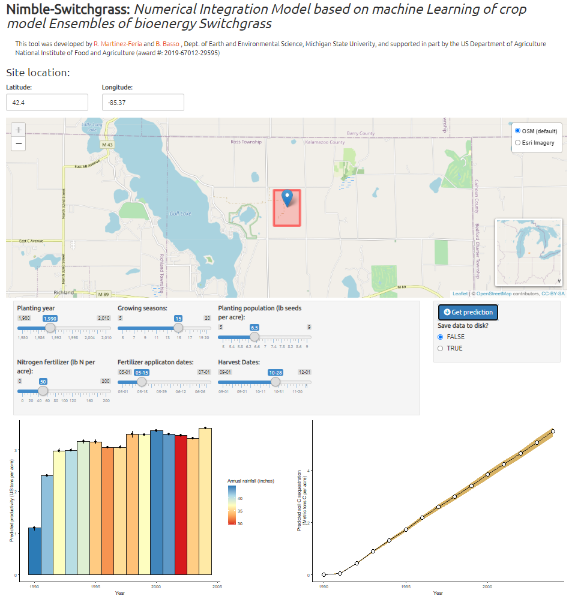
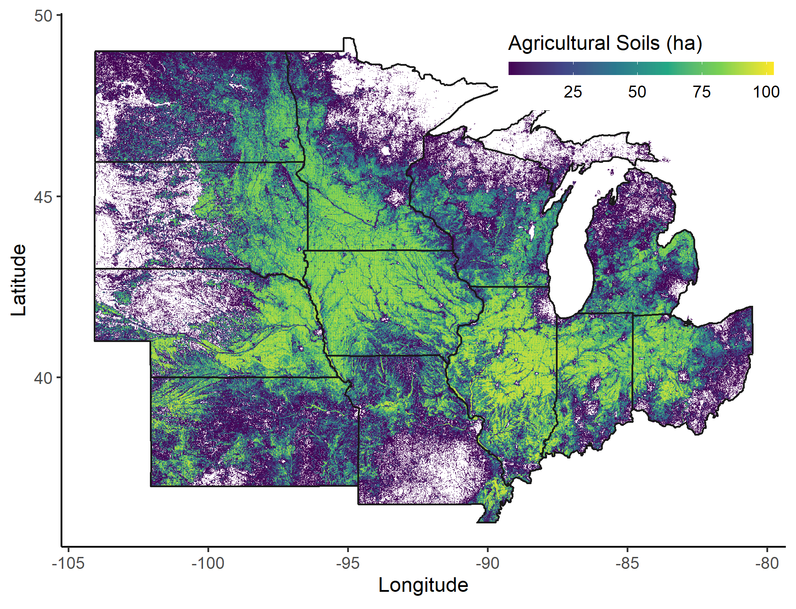

# NIMBLE-Switchgrass 
This repo contains a shiny wrapper to run the NIMBLE (Numerical Integration Model based on machine Learning of crop model Ensembles) emulator for predicting yields and soil carbon sequestration of bioenergy switchgrass in the US Midwest.



## About the code 

Predictions are made using a  Gradient Boosted Machines (GBM) algorithm trained using the `h2o` platform in R. To ensure full compatibility, make sure to use the H2O cluster version `3.32.0.1`.

```{r}
install_version("h2o", version = "3.32.0.1", repos = "http://CRAN.R-project.org")
```

The fitted GBM models are included in the `_models` folder. 


Additional packages need to run the shiny tool include:
```{r}
install.packages(c("shiny","leaflet","shinythemes","dplyr","ggplot2",
                   "h2o","lubridate"))
```


## Data inputs

The `_data/spatial` folder contains all the weather/soil inputs needed to run the emulator, aggregated to the 0.01 degree spatial resolution. 



In addition, you need to choose the management configuration desired to run the prediction.  

* Years = Number of years to run (5 to 20) 
* PlantYear = Year of start of emulation (1980-2010)
* PlantingPop = Planting population in plants/m2 (300-1200)
* HarvestDOY = Day of year of application of fertilizer (210-350)
* FertilizerDOY = Day of year of application of fertilizer (90-200)
* FertilizerRate Nitrogen fertilizer rate in kg N/ha (0-200)

Note that the Shiny tool does the conversion from Imperial units to metric. 

## Outputs

If `Save to disk = TRUE`, then the run will be saved to `_output` folder.

The output `csv` file will contain all the inputs used to run the model in addition to two output columns:

* yield = Agronomic yields in Mg/ha
* dsoc = Annual SOC change in Mg C/ha

`emulator_batch_example.r` includes annotated code that can be used to run multiple locations simultaneously. 

## Contact

* Questions about the code and methodology: [Rafael Martinez-Feria](mailto:mart2225@msu.edu), Michigan State University. 